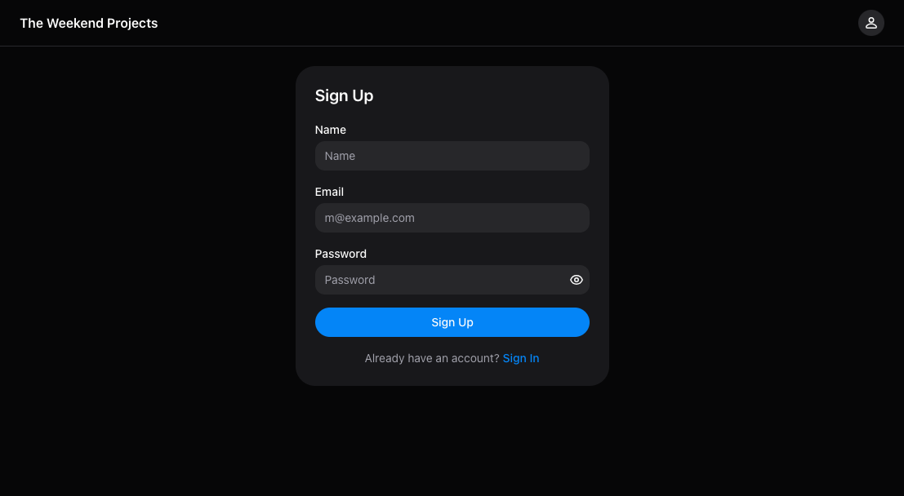
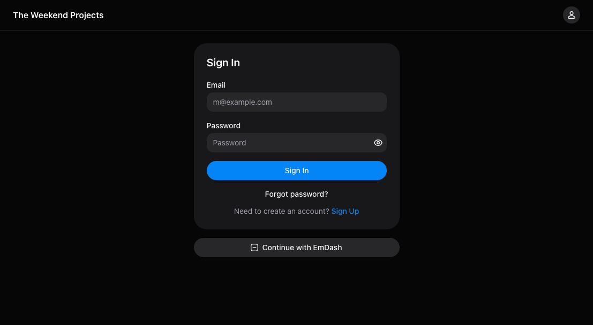
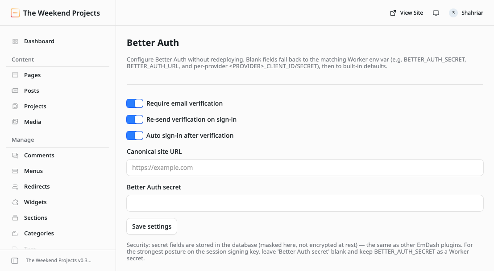

<div align="center">

# 🔐 emdash-better-auth

### Drop-in email/password + social login for [EmDash](https://emdashcms.com), powered by [Better Auth](https://better-auth.com)

Turn EmDash from a passkey-first CMS admin into a full auth backend for your **public-facing app or membership site** — signup, email verification, password reset, and Google/GitHub login — in one line of config, with **zero database migrations**.

[](https://www.npmjs.com/package/emdash-better-auth)
[](https://www.npmjs.com/package/emdash-better-auth)
[](./LICENSE)
[](https://emdashcms.com)
[](https://better-auth.com)

**[Live demo](https://theweekendprojects.com/auth/sign-up)** · **[npm](https://www.npmjs.com/package/emdash-better-auth)** · **[Quickstart](#quickstart)**



</div>

---

Email/password (and optional social — **Google, GitHub**) authentication for [EmDash](https://emdashcms.com) sites, powered by [Better Auth](https://better-auth.com) with prebuilt [Better Auth UI](https://better-auth-ui.com) (HeroUI) sign-in / sign-up pages.

It registers as an EmDash `AuthProviderDescriptor`, so it plugs in with a single line and ships everything it needs — the API handler, the styled auth pages, and a light/dark/system theme toggle — with **no per-site database migrations**.

> [!NOTE]
> Built on [Better Auth](https://better-auth.com), so it's a **foundation, not a one-off**: sign-ups flow onto EmDash's own `users` table through a Better Auth adapter, which opens the door to the wider Better Auth ecosystem (more social providers, 2FA, username login, organizations, Stripe billing) as future additions on the same bridge.

## ✨ Highlights

| | |
| --- | --- |
| 🧩 **One-line install** | Register `betterAuthProvider()` and you get sign-in, sign-up, forgot/reset password, and sign-out routes. |
| 👤 **Real EmDash users** | Sign-ups land in EmDash's own `users` table (RBAC-governed) — no second user store, no migrations. |
| 🎨 **Prebuilt, themed UI** | HeroUI sign-in/sign-up pages with a dark / light / system toggle, self-contained (won't touch your site's styles). |
| ✉️ **Mandatory email verification** | Blocks bot signups; re-sends the link on blocked login and auto-signs-in on click. |
| 🔑 **Social login** | Google & GitHub out of the box, per-provider, data-driven and easy to extend. |
| ⚙️ **Admin settings page** | Configure verification, canonical URL, and OAuth credentials from the admin UI — no redeploy. |
| 🔔 **Username support** | Sign in with username, public identity without exposing email. Always required. |

## 📸 Screenshots

The hero above shows the sign-up page (light). Here's dark mode and the admin config surface:

<table>
  <tr>
    <td align="center" width="50%">
      <br />
      <sub><b>Sign-in</b> — dark theme (light / dark / system toggle, persisted per visitor)</sub>
    </td>
    <td align="center" width="50%">
      <br />
      <sub><b>Admin settings</b> — verification toggles, canonical URL, and per-provider OAuth credentials, configurable without a redeploy</sub>
    </td>
  </tr>
</table>

## Quickstart

```bash
pnpm add emdash-better-auth
pnpm add -D @tailwindcss/vite            # required — compiles the auth-page styles
wrangler secret put BETTER_AUTH_SECRET   # required — `openssl rand -base64 32`
```

```js
// astro.config.mjs
import react from "@astrojs/react";
import tailwindcss from "@tailwindcss/vite";
import { betterAuthProvider, betterAuthSettingsPlugin } from "emdash-better-auth";

export default defineConfig({
  output: "server",
  vite: { plugins: [tailwindcss()] },          // required for the HeroUI auth styles
  integrations: [
    react(),                                    // auth pages are React islands
    emdash({
      /* ...your database/storage... */
      authProviders: [betterAuthProvider()],    // sign-in/up, /auth/*, /login, /signup
      plugins: [betterAuthSettingsPlugin()],    // optional: admin settings page
    }),
  ],
});
```

Deploy, then visit `/login` or `/signup`. Email verification is **on by default** — see
[Email](#email-password-reset--verification) (a working email provider is required).
Social logins (Google, GitHub) and everything else are optional; details below.

## What you get

- **Real EmDash users.** A Better Auth sign-up creates a row in EmDash's own `users` table, so the account is a first-class EmDash user: visible in the admin and governed by EmDash RBAC (the `role` column). New sign-ups default to the lowest role (subscriber, `10`) so hitting `/signup` never grants admin access.
- **Prebuilt, styled auth pages** at `/auth/*` (plus `/login` and `/signup` aliases) — sign-in, sign-up, forgot-password, reset-password, sign-out. Self-styled with HeroUI; they don't touch your site's theme.
- **Light / Dark / System theme toggle** on the auth pages, persisted per visitor.
- **Session bridging.** After sign-in/up the plugin writes EmDash's own session cookie, so the same account works for both the public site and `/_emdash/admin` (subject to role).
- **Portable storage.** Better Auth's session/account/verification state lives in EmDash's shared plugin storage (`getAuthProviderStorage`), namespaced `auth:better-auth` — no custom tables, no migration files.
- **Social sign-in (Google, GitHub).** Enabled per-provider when credentials are configured (env vars or the admin UI). Data-driven and easy to extend to more providers — see [Enabling social sign-in](#enabling-social-sign-in).
- **Optional admin settings UI.** An opt-in companion plugin (`betterAuthSettingsPlugin()`) adds a Better Auth settings page to the EmDash admin sidebar — verification toggles, canonical URL, the Better Auth secret, and per-provider social credentials — read at request time with env-var fallback. See [Admin settings](#admin-settings-optional).
- **Username sign-in.** Users must register with a username (unique handle) and can sign in with it instead of email. The username is public; the email is kept private. See [Username support](#username-support).

## Requirements

- **EmDash** `^0.30.0`
- **React** `>=19.2.6` and **react-dom** `>=19.2.6` (HeroUI peer requirement; bump your site if it pins an older patch)
- **`@astrojs/react`** integration in your Astro config (the auth pages are React islands)
- **`@tailwindcss/vite`** wired into your Astro config — **required**. Better Auth UI (HeroUI) ships its styles as Tailwind v4 source, which must be compiled. Without this the auth pages render unstyled.
- A Cloudflare Workers deployment (this plugin reads secrets from the Worker `env` and uses EmDash's D1-backed storage). Other adapters may work but are untested.

## Install

```bash
pnpm add emdash-better-auth
# peer/build deps if your project doesn't already have them:
pnpm add -D @tailwindcss/vite
```

> Supply-chain note: the `@better-auth-ui/*` packages are released frequently. If your project enforces a pnpm `minimumReleaseAge` cooldown, add `"@better-auth-ui/*"` to `minimumReleaseAgeExclude` in `pnpm-workspace.yaml`.

## Setup

### 1. Register the provider

```js
// astro.config.mjs
import cloudflare from "@astrojs/cloudflare";
import react from "@astrojs/react";
import tailwindcss from "@tailwindcss/vite";
import { betterAuthProvider } from "emdash-better-auth";
import { defineConfig } from "astro/config";
import emdash from "emdash/astro";

export default defineConfig({
  output: "server",
  adapter: cloudflare(),
  // Required: compiles the HeroUI auth styles. Output is scoped to the auth
  // island, so it does not affect your site's own styling.
  vite: { plugins: [tailwindcss()] },
  integrations: [
    react(),
    emdash({
      // ...your database/storage config...
      authProviders: [betterAuthProvider()],
    }),
  ],
});
```

That's it — the plugin injects all of these routes for you:

| Route | Purpose |
| --- | --- |
| `/api/auth/[...all]` | Better Auth API handler (sign-in, sign-up, callbacks, get-session, sign-out) |
| `/auth/[...path]` | Prebuilt auth UI: `/auth/sign-in`, `/auth/sign-up`, `/auth/forgot-password`, `/auth/reset-password`, `/auth/sign-out` |
| `/login` | Friendly alias → `/auth/sign-in` |
| `/signup` | Friendly alias → `/auth/sign-up` |

Do **not** create your own `src/pages/login.astro` / `signup.astro` / `api/auth/*` — they would conflict with the injected routes.

**Two login doors, on purpose.** EmDash's native passkey login at
`/_emdash/admin/login` is left untouched, so existing passkey admins keep
working. The Better Auth pages (`/auth/sign-in`, `/login`) are an additional
email/password door. Because a Better Auth account *is* an EmDash user (same
`users` table), an admin (role ≥ 50) can sign in through **either** door and
get full CMS access. Don't redirect `/_emdash/admin/login` to Better Auth
unless every admin has an email/password credential — passkey-only admins would
be locked out.

### 2. Set the runtime secrets

The plugin reads these from the Worker environment at request time. Set them as Cloudflare secrets (not just `.env` — `.env` is build-time only and is **not** available to the deployed Worker):

```bash
# Required. Generate with: openssl rand -base64 32
wrangler secret put BETTER_AUTH_SECRET

# Optional — enables social sign-in (per provider; omit for email/password only)
wrangler secret put GOOGLE_CLIENT_ID
wrangler secret put GOOGLE_CLIENT_SECRET
wrangler secret put GITHUB_CLIENT_ID
wrangler secret put GITHUB_CLIENT_SECRET
```

| Variable | Required | Notes |
| --- | --- | --- |
| `BETTER_AUTH_SECRET` | Yes | Signing/encryption secret. At least 32 chars, high entropy. |
| `GOOGLE_CLIENT_ID` / `GOOGLE_CLIENT_SECRET` | No | Enables Google sign-in when both are set (or set them in the admin UI). Disabled if either is missing or left as a placeholder. |
| `GITHUB_CLIENT_ID` / `GITHUB_CLIENT_SECRET` | No | Enables GitHub sign-in when both are set (or via the admin UI). Same rules as Google. |
| `BETTER_AUTH_URL` | No | Canonical public origin (e.g. `https://blog.example.com`). See below. |

#### Base URL / canonical origin

Verification and password-reset **emails** contain absolute links (a link opened
later from a mail client has no "current origin", so relative URLs are
impossible). The plugin resolves that canonical origin at request time, in
priority order:

1. **`BETTER_AUTH_URL`** (or `BETTER_AUTH_BASE_URL`) env var — an explicit
   override. Highest priority.
2. **Astro's `site` config** — if you set `site:` in `astro.config.mjs` (common
   for canonical URLs / sitemaps), the plugin reuses it automatically. No extra
   config.
3. **The request origin** — zero-config fallback for a single-domain site.

So adoption is friction-tiered: a single-domain blog needs **nothing**; a blog
that already sets `site:` gets it **for free**; only multi-domain setups need
the env var.

> **Multi-domain / proxied deployments must set tier 1 or 2.** If your app is
> reachable on more than one hostname (e.g. a custom domain *and* the raw
> `*.workers.dev` URL, or behind a proxy), the request origin (tier 3) is
> ambiguous — a request that happens to arrive on the `workers.dev` host would
> otherwise bake that host into email links. Set `site:` in `astro.config.mjs`
> (recommended — also fixes canonical URLs/RSS) or the `BETTER_AUTH_URL` secret.
> The origin the request came in on is always added to `trustedOrigins`, so
> logging in via the non-canonical host still works; only the generated links
> are forced to the canonical origin.

Client-side calls are already origin-relative (resolved from `window.location`),
so they need none of this.

#### Enabling social sign-in

Ships with **Google** and **GitHub**. Each provider turns on only when BOTH its
client ID and secret are configured — via env vars (above) or the admin UI (see
[Admin settings](#admin-settings-optional)). A half-configured provider (id but
no secret, or vice versa) stays off. The auth pages show a provider's button
automatically once it's enabled; no code change needed.

For each provider you want:

1. Create an OAuth app in the provider's developer console:
   - Google — [Google Cloud Console](https://console.cloud.google.com/apis/credentials), an OAuth **Web application** client.
   - GitHub — **Settings → Developer settings → OAuth Apps → New OAuth App**.
2. Register the **authorized redirect / callback URL** (Better Auth's default
   callback path — the admin settings page also shows this per provider, ready
   to copy):
   - Google: `https://<your-domain>/api/auth/callback/google`
   - GitHub: `https://<your-domain>/api/auth/callback/github`
3. Provide the credentials, either as Worker secrets:
   ```bash
   wrangler secret put GOOGLE_CLIENT_ID
   wrangler secret put GOOGLE_CLIENT_SECRET
   # and/or
   wrangler secret put GITHUB_CLIENT_ID
   wrangler secret put GITHUB_CLIENT_SECRET
   ```
   …or by pasting them into the **Better Auth** admin settings page (per-provider
   section, with its own Save button). Saved settings win over env vars per field.

For local development, put the same values in `.dev.vars` so `wrangler dev`
picks them up.

**Adding another provider** (Better Auth supports Apple, Discord, Microsoft,
GitLab, Facebook, X, …): extend the `SocialProviderId` union in `auth.ts` and add
an entry to `SOCIAL_PROVIDERS` in `settings.ts` (`{ id, label, envPrefix }`,
where `id` is Better Auth's provider id). The admin section, kv keys, env
fallback (`<PREFIX>_CLIENT_ID/SECRET`), and callback URL are all derived from
that list — no other wiring needed. Facebook was intentionally left out of the
initial set to keep it simple.

### 3. Deploy

```bash
pnpm build && wrangler deploy
```

Then visit `/login` or `/signup`.

### Admin settings (optional)

By default the plugin is configured entirely through Worker env vars (above).
If you also want to tune it from the EmDash admin UI — without redeploying —
register the **companion settings plugin** alongside the auth provider:

```ts
// astro.config.mjs
import { betterAuthProvider, betterAuthSettingsPlugin } from "emdash-better-auth";

emdash({
  authProviders: [betterAuthProvider()],
  plugins: [betterAuthSettingsPlugin()], // adds a "Better Auth" admin sidebar page
});
```

It adds a **Better Auth** entry to the admin sidebar (under Plugins) at
`/_emdash/admin/plugins/better-auth-settings/settings`, rendering a settings
form. Saved values persist to the plugin's key-value store (the `options`
table, keys `plugin:better-auth-settings:settings:<field>`); the auth provider
reads them back at request time via `getPluginSettings(...)`.

Why a separate plugin? Better Auth registers as an EmDash *auth provider*, and
that registration path has no admin-settings surface — only the full plugin
system (`plugins: [...]`) can contribute admin UI. `betterAuthSettingsPlugin()`
is a tiny native plugin whose only job is to own that settings page + storage.

Why a custom page rather than EmDash's declarative `settingsSchema`
auto-render? The auto-rendered form only surfaces inside the admin **Plugins
manager** page, which loads the plugin-list endpoint first. On the EmDash
version this was built against, that endpoint returns a 500 (a pre-existing
core bug, unrelated to this plugin — it throws before this plugin is reached),
so a `settingsSchema` form never displays. So the plugin renders its own page
via `adminPages` + a `routes.admin` handler (the same mechanism `emdash-smtp`
uses) — it gets its own sidebar link and route and doesn't touch the broken
list endpoint. If/when that core bug is fixed, this could be simplified back to
`settingsSchema`.

The form exposes:

| Setting | Type | Notes |
| --- | --- | --- |
| Require email verification | toggle | Block unverified sign-in (default on). |
| Re-send verification on sign-in | toggle | Re-send the link on a blocked login (default on). |
| Auto sign-in after verification | toggle | Log in on link click (default on). |
| Canonical site URL | url | Overrides `BETTER_AUTH_URL` / `site:` for email links. |
| Better Auth secret | secret | Session signing key. See the security note below. |
| Social sign-in (Google, GitHub) | string / secret per provider | One stacked section per provider — client ID + secret, plus the read-only callback URL to register. Its own Save button. |

**Precedence:** a saved admin setting wins over the matching env var, which
wins over the built-in default. Every field is optional — leave one blank and
the env var / default is used. So the settings plugin is purely additive: with
all fields blank it changes nothing, and the site keeps working via env vars if
the settings can't be read.

> **Security — secrets are stored in the database, not encrypted.** The masked
> secret field only *hides* the input in the UI; the value is persisted in the
> `options` table (D1) as plaintext, the same way `emdash-smtp` stores its API
> key. For the **Better Auth secret** specifically — the session signing key —
> DB storage is meaningfully weaker than a Worker secret: if the database
> leaks, sessions can be forged. **Recommended:** leave the "Better Auth
> secret" field blank and keep `BETTER_AUTH_SECRET` as a Worker secret. Use the
> admin field for it only if you accept that tradeoff (e.g. pending an EmDash
> feature for encrypted-at-rest secret storage).

> **Watch out for browser autofill on the credential fields.** A password
> manager may silently populate the "Better Auth secret" and the per-provider
> client ID / secret fields with saved credentials for the site; clicking
> **Save** would then persist those junk values (and, for the signing key,
> rotate every session; for a provider, enable it with bad credentials). Blank
> secret fields are left untouched on save — but autofill makes them non-blank.
> Before saving any section, confirm its fields are actually empty (or hold the
> value you intend).
> If a wrong value gets saved, clearing it in the form won't remove it (blank =
> "keep existing"); delete the row directly, e.g.
> `DELETE FROM options WHERE name = 'plugin:better-auth-settings:settings:betterAuthSecret';`

> **Note on the post-sign-up redirect.** The auth UI decides whether to route to
> the "verify your email" page after sign-up based on a client-side flag that
> defaults to `true` (matching the default server config). If you turn
> *Require email verification* **off** in the admin UI, also pass
> `requireEmailVerification={false}` to `AuthView` (or the auth page) so the UI
> stops sending new users to the verify page. The server remains authoritative
> either way; this only affects the redirect.

### Username support

Better Auth's [username plugin](https://better-auth.com/docs/plugins/username) adds a unique handle for public identity without exposing the email address. The plugin implements this via **plugin storage only** — no EmDash core changes or migrations needed.

| Feature | Details |
| --- | --- |
| **Username sign-in** | Users sign in with `username` instead of email (`authClient.signIn.username({ username, password })`). |
| **Unique index** | Username uniqueness is enforced atomically by the storage layer (`uniqueIndexes: ["username"]`), no check-then-write race. |
| **Email private** | A verified email is still required for account recovery, but never shown publicly. |
| **Always required** | Username is mandatory for all new sign-ups; no admin toggle needed. |
| **Display name** | `displayUsername` is stored alongside (the user-typed form, normalized for storage). |

**How it works:**
- Username records are stored in EmDash's `_plugin_storage` table under `auth:better-auth:usernames`.
- The EmDash adapter automatically creates/syncs/cleans up username records on user create/update/delete.
- Better Auth UI renders the username field automatically when the username plugin is enabled.

**No core migration needed.** EmDash's `users` table has no `username` column — the plugin stores usernames in its own storage collection with a unique index. This matches Better Auth's recommendation for databases that don't support native unique constraints on user columns.

> **Why username is always required:** A mix of users with and without usernames would create a messy, inconsistent experience for bylines, comments, and public identity features. Email remains required for account recovery (password reset, etc.), but the username is the public-facing identity.

### Email: password reset & verification

### Email: password reset & verification

Better Auth doesn't send email itself — it hands the plugin a message + link,
and the plugin delivers it through EmDash's email pipeline (`runtime.email`).
So these features work **only if the site has an email provider configured**:

- **Password reset** (`/auth/forgot-password`) — sends a reset link.
- **Email verification** — a verification email is sent on sign-up.

The plugin is **provider-agnostic**: it never depends on a specific email
service. It calls `runtime.email.send(..., "system")`, and whatever
`email:deliver` provider the site registers actually sends it. To enable email
on a site, install an EmDash email provider — e.g.
[`emdash-smtp`](https://github.com/masonjames/emdash-smtp) (supports Resend,
SES, SMTP, and more) — add it to `emdash({ plugins: [...] })`, pick a provider
in **Admin → Settings → Email**, and set that provider's key (e.g.
`RESEND_API_KEY`) as a Worker secret.

**Email verification is mandatory.** `emailAndPassword.requireEmailVerification`
is `true`, so a new account cannot sign in until its address is confirmed. On
sign-up a verification link is emailed; on any sign-in attempt by an unverified
user Better Auth rejects the login (`EMAIL_NOT_VERIFIED`), the UI routes to
`/auth/verify-email`, and — because `emailVerification.sendOnSignIn` is `true` —
the link is re-sent so the user doesn't have to find the original email.
Clicking the link verifies the address and (via `autoSignInAfterVerification`)
logs them straight in. This is deliberate: it stops bot-created accounts from
ever becoming usable. `email_verified` flips true when the link is clicked.

> **Because verification is mandatory, a working email provider is required.**
> Unlike password reset (which just fails quietly without a provider), signup is
> a dead end if verification emails can't be delivered — users create an account
> they can never log into. Configure an email provider before going live. In dev,
> EmDash's built-in console provider logs the email so you can copy the link from
> the terminal. To relax this to "soft" verification (email sent, but login not
> blocked), turn off *Require email verification* in the admin settings (see
> [Admin settings](#admin-settings-optional)) — or, if you don't use the
> settings plugin, set `emailAndPassword.requireEmailVerification: false` in
> `auth.ts`. `true` is the default in both cases.

**Graceful for password reset.** If no provider is configured, password-reset
emails simply aren't sent (logged, never thrown) rather than crashing auth.

### No database migration required

This plugin ships **no migration files** and you don't need to write any. It reuses tables EmDash already manages:

- **`users`** — EmDash's core users table (created by EmDash's own migrations, which run automatically on first request). Sign-ups insert rows here.
- **`_plugin_storage`** — EmDash's shared plugin-storage table (also core). Better Auth's `accounts` / `sessions` / `verifications` records are stored here under the `auth:better-auth` namespace. The indexes for those collections are created **automatically at runtime** from the `storage` config in `betterAuthProvider()` — no SQL, no migration step.

So on a fresh site the correct sequence is just: register the provider, set `BETTER_AUTH_SECRET`, deploy, and load a page once so EmDash applies its core migrations. If you inspect the D1 database, do not add or expect `auth_*` tables — this plugin does not use any bespoke tables.

## How it works

- **User model → EmDash `users` table** via a custom Better Auth adapter (`emdashAdapter`), with field mapping (`emailVerified` → `email_verified`, `image` → `avatar_url`, etc.).
- **account / session / verification → EmDash plugin storage** (`getAuthProviderStorage(db, "better-auth", ...)`), stored in the shared `_plugin_storage` table under the `auth:better-auth` namespace. No custom tables.
- **The auth pages are a React island** (`AuthView`) rendering Better Auth UI's `<Auth path=... />` inside `QueryClientProvider` + `AuthProvider`, pointed at the `/api/auth` handler. HeroUI styles are compiled by Tailwind and loaded **only** on the auth routes.
- **Session bridge:** on a successful sign-in/up the injected route calls `context.session.set("user", { id })`; on sign-out it destroys that session. EmDash's own middleware reads that key, so the login is recognized site-wide.

## Customization

- **Default role for new sign-ups** is subscriber (`ROLE_SUBSCRIBER = 10`). Promote users to higher roles from the EmDash admin UI; once promoted they can also access `/_emdash/admin`.
- **Post-auth redirect** defaults to `/`. The pages honor a `?redirect=<path>` query param.
- **Theme** defaults to system; visitors can switch Light/Dark/System and the choice persists in `localStorage`.
- **Use the island directly** if you want auth UI on your own page instead of the injected routes:

  ```astro
  ---
  import AuthView from "emdash-better-auth/ui";
  ---
  <AuthView path="sign-in" redirectTo="/" client:load />
  ```

- **Use the client** in your own components:

  ```ts
  import { authClient } from "emdash-better-auth/client";
  await authClient.signIn.email({ email, password });
  ```

## Package exports

| Export | What |
| --- | --- |
| `.` | `betterAuthProvider()`, `createBetterAuth`, `emdashAdapter`, `PROVIDER_ID`, `BETTER_AUTH_STORAGE_CONFIG`, `ROLE_SUBSCRIBER` |
| `./client` | Better Auth browser client (`authClient`) |
| `./ui` | `AuthView` React island |
| `./route` | The `/api/auth/[...all]` handler (injected automatically) |
| `./pages/auth`, `./pages/login`, `./pages/signup` | The injected Astro pages |
| `./admin` | Login button shown on EmDash's admin login page |
| `./auth`, `./adapter` | Lower-level `createBetterAuth` / `emdashAdapter` |

## Notes & limitations

- **Cloudflare Workers–oriented.** Secrets come from the Worker `env`; storage uses EmDash's D1-backed plugin storage.
- **Social sign-in (Google, GitHub)** requires real credentials (Worker secrets or the admin UI); each provider is hidden until both its ID and secret are set.
- **Dependency footprint.** The prebuilt UI pulls in HeroUI v3 + several TanStack packages. The client bundle loads only on the `/auth` routes, not your content pages.
- **Email verification is mandatory and requires a working email provider.** Sign-up creates the account but blocks login until the emailed link is clicked, so a site with no `email:deliver` provider configured leaves new users unable to log in. Configure a provider (see *Email* above) before enabling public sign-up, or set `requireEmailVerification: false` in `auth.ts` to soften it.

## Reusing on another EmDash site

The plugin is designed to be site-agnostic — nothing is hardcoded to a
particular site:

- **No hardcoded URLs or brand.** The public origin is derived from the
  request; the auth header's brand name is read from EmDash site settings
  (`getSiteSettings().title`), falling back to "Account".
- **No database migrations.** It reuses EmDash's `users` and `_plugin_storage`
  tables (auto-created by EmDash core); storage indexes are created at runtime.
- **Secrets** come from the Worker `env`, not committed code.

To use it on another site: install the package, add the setup from
[Setup](#setup) (register `betterAuthProvider()`, add `@tailwindcss/vite`, set
`BETTER_AUTH_SECRET`), deploy.

**If you fork / rename the package** (it's currently `emdash-better-auth`):
the `AuthProviderDescriptor` and the settings-plugin descriptor in
`src/index.ts` reference the package by name in their route `entrypoint`s and
`adminEntry`. Astro's `injectRoute` resolves those as module specifiers at the
consuming site's build time, so they must equal the package's own `name`. They
are all derived from a single `PACKAGE_NAME` constant at the top of
`src/index.ts` — update **just that constant and the `name` in `package.json`**
(keep them identical) and everything else follows.

## Roadmap

Built on Better Auth, so the ecosystem is the runway. Planned / under consideration
(tracked in [Issues](https://github.com/theweekendprojects/emdash-better-auth/issues)):

- **Two-factor authentication** — TOTP authenticator apps + email OTP, with backup codes ([two-factor](https://better-auth.com) / [email-otp](https://better-auth.com) plugins). Targeting **v0.2.0**.
- **More social providers** — Apple, Discord, Microsoft, GitLab, X (the provider list is data-driven; adding one is a two-line change).
- **Magic-link** sign-in.
- **Organizations / teams** and **Stripe billing** — larger, exploratory.

Have a request or want to help? Open an issue or PR.

## License

MIT
