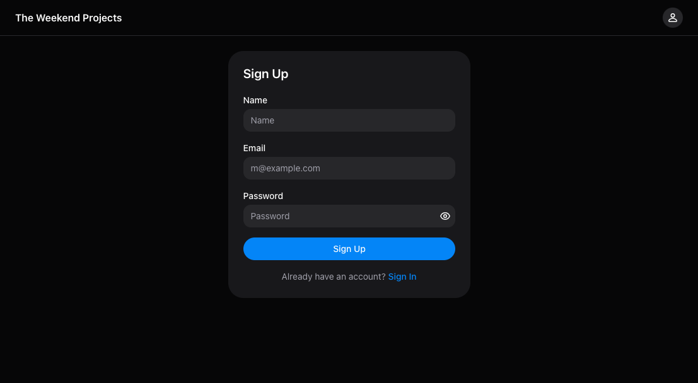

<div align="center">

# 🔐 emdash-better-auth

### Full authentication for [EmDash](https://emdashcms.com), powered by [Better Auth](https://better-auth.com)

Email/password + social login, passwordless, 2FA, passkeys, organizations, an
OIDC provider, Stripe billing, and audit logging — added to an EmDash site in
**one line of config**, with **no database migrations**.

[](https://www.npmjs.com/package/emdash-better-auth)
[](./LICENSE)
[](https://emdashcms.com)
[](https://better-auth.com)

**[Live demo](https://theweekendprojects.com/auth/sign-up)** · **[npm](https://www.npmjs.com/package/emdash-better-auth)** · **[Quickstart](#quickstart)**



</div>

---

EmDash ships with passkey-only admin login. This plugin turns it into a full
auth backend for your **public app or membership site**: prebuilt, themed
sign-in / sign-up / account pages, and a long list of optional Better Auth
features you flip on from an admin settings page — no redeploy.

It registers as an EmDash `AuthProviderDescriptor`, so sign-ups become
first-class rows in EmDash's own `users` table (governed by EmDash RBAC). No
second user store, no `auth_*` tables, no migration files.

## Highlights

| | |
| --- | --- |
| 🧩 **One-line install** | `authProviders: [betterAuthProvider()]` adds sign-in, sign-up, reset, account, and the `/api/auth` handler. |
| 👤 **Real EmDash users** | Sign-ups land in EmDash's `users` table — no second store, no migrations. |
| 🎨 **Prebuilt themed UI** | HeroUI pages with a light / dark / system toggle, self-contained (won't touch your site's styles). |
| ⚙️ **Admin settings page** | Toggle every feature, set the canonical URL, and manage secrets from the admin UI — no redeploy. |
| ✉️ **Email verification** | On by default: blocks bot signups, re-sends on blocked login, auto-signs-in on click. |
| 🧰 **The Better Auth suite** | Social login, passwordless, 2FA, passkeys, API keys, organizations, OIDC provider, Stripe billing, audit log — all opt-in. |

## Quickstart

```bash
pnpm add emdash-better-auth
pnpm add -D @tailwindcss/vite            # required — compiles the auth-page styles
wrangler secret put BETTER_AUTH_SECRET   # required — openssl rand -base64 32
```

```js
// astro.config.mjs
import react from "@astrojs/react";
import tailwindcss from "@tailwindcss/vite";
import { betterAuthProvider, betterAuthSettingsPlugin } from "emdash-better-auth";

export default defineConfig({
  output: "server",
  vite: { plugins: [tailwindcss()] },          // required for the HeroUI auth styles
  integrations: [
    react(),                                    // auth pages are React islands
    emdash({
      /* ...your database / storage... */
      authProviders: [betterAuthProvider()],    // sign-in/up, /auth/*, /account/*
      plugins: [betterAuthSettingsPlugin()],    // optional: admin settings page
    }),
  ],
});
```

Deploy, then open `/login` or `/signup`.

> **Email verification is on by default**, so a working email provider is
> required or new users can't finish signing up. See [Email](#email). Everything
> beyond email/password is optional — turn features on from the settings page.

## Requirements

- **EmDash** `>=0.30.0`, on **Cloudflare Workers** (D1 + R2). Other adapters are untested.
- **`@astrojs/react`** and **`@tailwindcss/vite`** wired into your Astro config — both required. The auth pages are React islands, and HeroUI ships Tailwind v4 source that your site compiles. Without Tailwind the pages render unstyled.
- **React** `>=19.2.6` / **react-dom** `>=19.2.6` (HeroUI peer).

> **pnpm cooldown:** the `@better-auth-ui/*` packages release often. If you set a
> pnpm `minimumReleaseAge`, add `"@better-auth-ui/*"` to
> `minimumReleaseAgeExclude` in `pnpm-workspace.yaml`.

## Routes

All injected for you — don't create your own `login.astro` / `signup.astro` /
`api/auth/*`, they'd collide.

| Route | Purpose |
| --- | --- |
| `/api/auth/[...all]` | Better Auth API (sign-in, callbacks, get-session, sign-out, …) |
| `/auth/[...path]` | Sign-in, sign-up, forgot/reset password, verify email, sign-out |
| `/login`, `/signup` | Friendly aliases |
| `/account/[...path]` | Each user's own profile + security settings (login-gated) |
| `/admin/[...path]` | User management — only when *admin* is enabled, admins only |
| `/organization/[...path]` | Org / team management — only when *organizations* is enabled |
| `/audit-log` | Site-wide auth event log — only when *audit logging* is enabled, admins only |

**Two login doors, on purpose.** EmDash's passkey login at
`/_emdash/admin/login` stays untouched. The Better Auth pages are an *additional*
email/password door. A Better Auth account **is** an EmDash user, so an admin
(role ≥ 50) can sign in through either and get full CMS access. Don't redirect
`/_emdash/admin/login` to Better Auth unless every admin has an email/password
credential — passkey-only admins would be locked out.

## Configuration

Set these as **Cloudflare Worker secrets** (`.env` is build-time only and not
available to the deployed Worker):

| Variable | Required | Notes |
| --- | --- | --- |
| `BETTER_AUTH_SECRET` | **Yes** | Session signing key. `openssl rand -base64 32`. |
| `BETTER_AUTH_URL` | Multi-domain only | Canonical origin for email links (see below). |
| `<PROVIDER>_CLIENT_ID` / `_SECRET` | Per social provider | e.g. `GOOGLE_CLIENT_ID`. Provider turns on when both are set. |
| `STRIPE_SECRET_KEY` / `STRIPE_WEBHOOK_SECRET` | Billing only | Plus `STRIPE_PRICE_<PLAN>_MONTH` / `_YEAR` per plan. |
| `GENERIC_OAUTH_CONFIG` | Extra OIDC only | JSON array of extra OAuth/OIDC providers. |

Everything except `BETTER_AUTH_SECRET` can also be set from the admin settings
page, and a saved setting wins over its env var.

### Base URL (canonical origin)

Verification / reset **emails** contain absolute links, so the plugin needs a
canonical origin. It resolves one, in order:

1. `BETTER_AUTH_URL` (or `BETTER_AUTH_BASE_URL`) env var.
2. Astro's `site:` config, if set.
3. The request origin (zero-config, single-domain).

> **Multi-domain / proxied sites must set tier 1 or 2.** If the app answers on
> more than one host (custom domain *and* `*.workers.dev`, or behind a proxy),
> the request origin is ambiguous and would bake the wrong host into email
> links. Set `site:` (also fixes canonical URLs / RSS) or `BETTER_AUTH_URL`. The
> incoming origin stays trusted, so logging in via the other host still works.

### Session lifetime (recommended)

EmDash stores the signed-in user in the Astro session, whose cookie is a
browser-session cookie by default — it vanishes on browser restart, while Better
Auth's cookie lasts 7 days. The plugin re-bridges automatically when it notices
the mismatch, but matching the lifetime avoids the extra redirect:

```js
// astro.config.mjs → emdash() is an Astro integration; this is Astro's own session option
session: { cookie: { maxAge: 60 * 60 * 24 * 7 }, ttl: 60 * 60 * 24 * 7 },
```

## Admin settings page

Register `betterAuthSettingsPlugin()` (shown in the quickstart) to add a
**Better Auth** entry to the admin sidebar. From there you toggle features and
manage credentials with no redeploy. Precedence per field: **saved setting > env
var > built-in default**, so leaving a field blank falls back gracefully.

Feature toggles (all **off** by default except email verification):

| Feature | Default | What it adds |
| --- | --- | --- |
| Email verification (+ resend, auto sign-in) | **on** | Blocks unverified login. |
| Social sign-in | off | Google, GitHub, Facebook, X, Cloudflare — per provider. |
| Two-factor (TOTP) | off | Authenticator-app 2FA + backup codes. |
| Passkeys (WebAuthn) | off | Passwordless biometric / security-key sign-in. |
| API keys | off | User-created programmatic keys (stored hashed). |
| Admin user management | off | `/admin` — create/ban/impersonate, roles. |
| Organizations (+ teams) | off | `/organization` — multi-tenant orgs, invites. |
| OIDC / OAuth 2.1 provider | off | Make this site an identity provider for other apps. |
| Magic link / Email OTP | off | Passwordless email link or one-time code. |
| Guest (anonymous) sessions | off | "Continue as guest", claim an account later. |
| Multiple accounts per browser | off | Hold several accounts, switch between them. |
| Extra OAuth / OIDC providers | off | Keycloak, Okta, Auth0, … via `GENERIC_OAUTH_CONFIG`. |
| Breached-password check (HIBP) | off | Reject passwords found in known breaches. |
| Audit logging (+ retention) | off | `/audit-log` — auth events with IP, UA, severity. |
| Stripe billing | off | Subscription billing + a Billing tab per account. |

### Social sign-in

Each provider turns on only when **both** its client ID and secret are set (env
vars or the settings page). Create an OAuth app in the provider's console and
register the callback URL — the settings page shows it per provider, ready to
copy:

```
https://<your-domain>/api/auth/callback/<provider>
```

`<provider>` is `google`, `github`, `facebook`, `twitter` (for X), or
`cloudflare`. Adding another is a two-line change: add it to `SOCIAL_PROVIDERS`
in `settings.ts` and the `SocialProviderId` union in `auth.ts`; keys, env
fallbacks, admin card, and callback URL all derive from that.

## Email

Better Auth doesn't send email; it hands the plugin a link, which goes out
through EmDash's email pipeline (`runtime.email`). So verification and password
reset need a configured `email:deliver` provider — e.g.
[`emdash-smtp`](https://github.com/masonjames/emdash-smtp) (Resend, SES, SMTP).
Add it to `emdash({ plugins: [...] })`, pick it in **Admin → Settings → Email**,
and set its key (e.g. `RESEND_API_KEY`) as a Worker secret.

> **Email verification is mandatory by default.** A new account can't sign in
> until the emailed link is clicked, so **without an email provider, signup is a
> dead end**. Configure email before going live, or turn *Require email
> verification* off in the settings page. In dev, EmDash's console provider logs
> the link to the terminal. Password reset fails quietly (never crashes) when no
> provider is set.

## Extending the UI with your own Better Auth UI plugins

Better Auth UI plugins can add **settings tabs** (an extra tab on `/account`), **avatar-menu items** and routable
sub-pages. To add your own, point the package at a module that default-exports an array of plugins, with the
`betterAuthUi()` Vite plugin:

```ts
// astro.config.mjs
import { betterAuthUi } from "emdash-better-auth/vite";

export default defineConfig({
  vite: { plugins: [betterAuthUi({ plugins: "./src/better-auth-ui.ts" })] },
});
```

```ts
// src/better-auth-ui.ts
import { createAuthPlugin } from "@better-auth-ui/core";
import { Billing } from "./Billing"; // your React component

const myPlugin = createAuthPlugin("my-plugin", () => ({
  viewPaths: { settings: { billing: "billing" } },                // /account/billing
  settingsTabs: [{ view: "billing", label: "Billing", component: Billing }],
}));
export default [myPlugin()];
```

Every view this package renders (sign-in, account, admin, organization, audit log) registers the plugins, and the
`/account` and `/auth` pages allow the view paths the plugins declare under `viewPaths.settings` / `viewPaths.auth`.
Without `betterAuthUi()` the list is empty and nothing changes.

## Gotchas

- **Browser autofill on secret fields.** A password manager may fill the Better
  Auth secret, Stripe, and social-credential fields with junk. To prevent a
  stray save from clobbering a good value, those fields are **locked by
  default** — flip the per-section "Edit" toggle to change them, and the save
  path refuses to write a locked field. If a bad value did get saved, clearing
  the field won't remove it (blank = keep existing); delete the row directly:
  `DELETE FROM options WHERE name = 'plugin:better-auth-settings:settings:betterAuthSecret';`
- **Secrets are stored in the DB, not encrypted at rest** (the mask only hides
  the UI), same as `emdash-smtp`. For the session signing key this is weaker
  than a Worker secret — if the DB leaks, sessions can be forged. **Prefer
  leaving the "Better Auth secret" field blank and keeping `BETTER_AUTH_SECRET`
  as a Worker secret.**
- **Sign-out ends every account** on the browser when *multiple accounts* is on
  (Better Auth's own behavior). To sign out of just one, use the per-account
  action in the account page's "Manage accounts".
- **No migrations, but EmDash core migrations must have run.** On a fresh site:
  register the provider, set `BETTER_AUTH_SECRET`, deploy, load a page once so
  EmDash applies its own migrations. Don't expect `auth_*` tables — there are
  none.

## How it works

- **User model → EmDash `users` table** via a custom Better Auth adapter, with
  field mapping (`emailVerified` → `email_verified`, `image` → `avatar_url`, …).
  New sign-ups default to the lowest role (subscriber, `10`), so hitting
  `/signup` never grants admin.
- **account / session / verification → EmDash plugin storage**
  (`getAuthProviderStorage`, namespace `auth:better-auth`). No custom tables;
  indexes are created at runtime from the storage config.
- **Auth pages are a React island** rendering Better Auth UI, pointed at
  `/api/auth`. HeroUI styles compile via Tailwind and load **only** on these
  routes.
- **Session bridge.** On sign-in the route writes EmDash's own session cookie,
  so the login is recognized site-wide (admin included, subject to role). With
  multiple accounts, EmDash follows whichever account is active.
- **Username is always required** (public identity, unique, stored in plugin
  storage); email stays required for recovery but is never shown publicly.
- **Bio + avatar** live in `users.data` / `avatar_url` — no new columns. Avatar
  is a resized data URL (R2-backed upload is a planned follow-up).

## Exports

| Export | What |
| --- | --- |
| `.` | `betterAuthProvider()`, `betterAuthSettingsPlugin()`, `createBetterAuth`, `emdashAdapter`, `PROVIDER_ID`, `ROLE_SUBSCRIBER` |
| `./client` | Better Auth browser client (`authClient`) |
| `./ui` | `AuthView` React island |
| `./route`, `./auth`, `./adapter`, `./settings-plugin` | Lower-level pieces (injected automatically) |
| `./pages/*` | The injected Astro pages |
| `./admin` | "Continue with EmDash" button for EmDash's admin login |

## License

MIT
